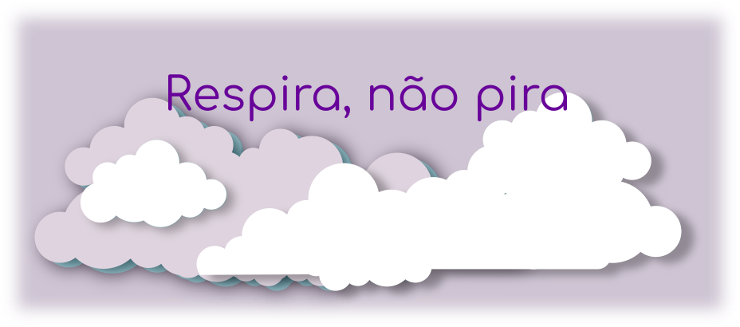
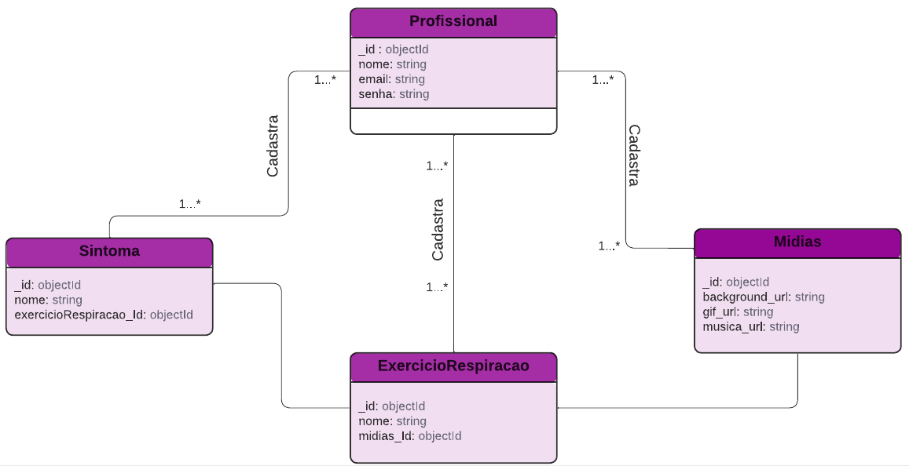

# Respira, não pira - API de Exercícios de Respiração

<div style="text-align:center">
  
</div>

Bem-vindo(a) ao projeto **Respira, não pira**, uma API Node.js e MongoDB responsável por proporcionar uma experiência única e personalizada para os usuários, oferecendo técnicas/exercícios de respiração com base na emoção que o usuário informar. O objetivo é auxiliar na promoção da saúde mental e bem-estar, fornecendo recursos para lidar com diferentes sentimentos de forma positiva e equilibrada.

## Sobre o Projeto

A **Respira, não pira** é uma API desenvolvida em Node.js, com o MongoDB como banco de dados ([diagrama](./materials/diagrama.pdf)) , para armazenar e fornecer exercícios de respiração com base nas emoções dos usuários. Quando um usuário informa um sentimento específico, a API responde com uma técnica de respiração apropriada, uma mensagem animadora relacionada ao sentimento, o tempo de duração recomendado para a respiração, um gif animado relaxante instruindo como deve ser feita a técnica e uma música de fundo para criar um ambiente tranquilo durante o exercício.

## Funcionalidades Principais

- **Obter Técnicas de Respiração por Emoção**: Através de requisições GET, os usuários podem receber uma lista de técnicas de respiração adequadas para a emoção informada.

- **Detalhes da Técnica**: Os usuários têm acesso aos detalhes completos de uma técnica de respiração específica, incluindo mensagem animadora, tempo de duração, gif animado e música de fundo.

## Restrições de Acesso

Para garantir a segurança e a precisão das informações fornecidas, apenas **assistentes de saúde mental** têm permissão para realizar operações de cadastro, atualização e exclusão das técnicas de respiração na API. As restrições foram feitas a partir do <em>jsonwebtoken</em> em conjunto com um encriptador em <em>hash</em>.

Os **usuários finais** têm acesso a todas as rotas da API que podem fazer requisições GET tanto para obter a lista completa de técnicas quanto para buscar uma técnica específica por meio de seu identificador (id). Não é necessário um token de autenticação para realizar essas consultas, visando tornar a experiência o mais simples e acessível possível.

## Fluxo de Funcionamento

- O usuário faz uma requisição à API informando a emoção que está sentindo.
- Com base na emoção fornecida, a API busca no banco de dados a técnica de respiração mais adequada para aquela emoção específica.
- A API retorna para o usuário uma descrição da técnica de respiração em formato de texto, apresentando as instruções para a prática da respiração.
- Em seguida, a API apresenta um gif animado na tela, demonstrando visualmente como o usuário deve executar a técnica de respiração.
- Após a exibição do gif animado, a API envia uma mensagem previamente guardada no banco de dados, relacionada à emoção do usuário, com o intuito de encorajar e motivar o usuário durante a prática do exercício.

Dessa forma, o fluxo de interação com a API pode ser resumido da seguinte maneira:

- Usuário envia a emoção para a API.
- API responde com a descrição da técnica de respiração.
- API exibe um gif animado para demonstrar a técnica.
- API envia uma mensagem de motivação relacionada à emoção.

É importante notar que as técnicas de respiração, gifs animados e mensagens de motivação são armazenados previamente no banco de dados da API. Os assistentes de saúde mental têm acesso para cadastrar, atualizar e deletar essas informações, garantindo que as práticas fornecidas sejam seguras e apropriadas para cada emoção.

Dessa forma, o usuário terá uma experiência completa e personalizada ao utilizar a API **Respira, não pira**, com recursos para auxiliá-lo na prática de técnicas de respiração com base em suas emoções e com o apoio de um gif animado e uma mensagem motivadora.

## Documentação da API

- <em>Breathing Exercise</em> (técnicas de respiração)
  
| Verbo  | Rota | Descrição                                 | Auth |
|--------|------|-------------------------------------------|------|
| GET    | /all | Busca todas as de técnicas de respiração  |   N  |
| GET    | /:id | Busca uma técnica de respiração por ID    |   N  |
| POST   | /add | Adiciona uma nova técnica de respiração   |   S  |
| PATCH  | /:id | Atualiza uma técnica de respiração por ID |   S  |
| DELETE | /:id | Remove uma técnica de respiração por ID   |   S  |

- <em>Breathing Exercise Media</em> (mídias de técnicas de respiração)
  
| Verbo  | Rota | Descrição                                          | Auth |
|--------|------|----------------------------------------------------|------|
| GET    | /all | Busca todas as mídias de técnicas de respiração    |   N  |
| GET    | /:id | Busca uma mídia de técnica de respiração por ID    |   N  |
| POST   | /add | Adiciona uma nova mídia de técnica de respiração   |   S  |
| PATCH  | /:id | Atualiza uma mídia de técnica de respiração por ID |   S  |
| DELETE | /:id | Remove uma mídia de técnica de respiração por ID   |   S  |

- <em>Symptom</em> (sintoma)
  
| Verbo  | Rota | Descrição                  | Auth |
|--------|------|----------------------------|------|
| GET    | /all | Busca todos os sintomas    |   N  |
| GET    | /:id | Busca um sintoma por ID    |   N  |
| POST   | /add | Adiciona um novo sintoma   |   S  |
| PATCH  | /:id | Atualiza um sintoma por ID |   S  |
| DELETE | /:id | Remove um sintoma por ID   |   S  |

- <em>Mental Health Assistent</em> (assistente de saúde mental)
  
| Verbo  | Rota | Descrição                                     | Auth |
|--------|------|-----------------------------------------------|------|
| GET    | /all | Busca todos os assistentes de saúde mental    |   N  |
| POST   |/login| Loga um assistente de saúde mental por ID     |   S  |
| POST   | /add | Adiciona um novo assistente de saúde mental   |   N  |
| DELETE | /:id | Remove um assistente de saúde mental por ID   |   N  |

Para uma compreensão mais detalhada sobre as rotas e os parâmetros disponíveis na API, consulte a [documentação](https://respira-nao-pira.onrender.com/minha-rota-de-documentacao/) fornecida. Tais rotas foram obtidas com o uso das ferramentas <em>Swagger</em> para documentar e <em>[Render](https://respira-nao-pira.onrender.com/minha-rota-de-documentacao/)</em> para fazer o deploy das rotas.

Vale salientar que as rotas de CRUD foram testadas com o auxílio do <em>jest</em>, construindo casos para retorno de cada elemento das schemas de <em>breathingExercise</em> (técnicas de respiração), <em>breathingExerciseMedia</em> (mídias de técnicas de respiração), <em>symptoms</em> (sintomas) bem como a alteração, exclusão e criação de objetos.

## Diagramas

<div style="text-align:center">
  
</div>

## Estrutura das pastas

```
        ├  on22-b3-projeto-final
        │ ├  assets
        │ │ ├  audios
        │ │ │   ├ 432-hz-meditation-157762.mp3
        │ │ │   ├ audio_d3e297ee42.mp3
        │ │ │   ├ cinematic-documentary-115669.mp3
        │ │ │   ├ meditation-background-music-for-vlog-video-43-sec-deep-thoughts-156359.mp3
        │ │ │   ├ meditative-rain-114484.mp3
        │ │ │   ├ one-warm-day-background-music-for-yoga-and-meditation-calming-rhythm-154349.mp3
        │ │ │   ├ relax-chill-out-music-for-landscapes-under-water-animals-forests-8105.mp3
        │ │ │   ├ relaxing-birds-and-piano-music-137153.mp3
        │ │ │   ├ relaxing-music-vol1-124477.mp3
        │ │ │   ├ soundtrack-reference-attribution.txt
        │ │ │   └ space-158081.mp3
        │ │ └  images
        │ ├  materials
        │ │ ├  backgrounds
        │ │ ├ diagrama .pdf
        │ │ ├ gifs
        │ │ └ prints-rotas
        │ │     ├ deleteBreathingExercise.png
        │ │     ├ deployedRoutes.png
        │ │     ├ getAllBreathingExercise.png
        │ │     ├ patchBreathingExercise.png
        │ │     ├ postBreathingExercise.png
        │ │     └ postLogin.png
        │ └  respira-nao-pira
        │     ├  node_modules
        │     ├ package-lock.json
        │     ├ package.json
        │     ├ server.js
        │     ├  src
        │     │ ├ app.js
        │     │ ├  controllers
        │     │ │   ├ breathingExerciseController.js
        │     │ │   ├ breathingExerciseMediaController.js
        │     │ │   ├ mentalHeathAssistentController.js
        │     │ │   └ symptomsController.js
        │     │ ├  database
        │     │ │   └ dbConnect.js
        │     │ ├  models
        │     │ │   ├ breathingExerciseMediaModel.js
        │     │ │   ├ breathingExerciseModel.js
        │     │ │   ├ mentalHeathAssistentModel.js
        │     │ │   └ symptomsModel.js
        │     │ └  routes
        │     │     ├ breathingExerciseMediaRoutes.js
        │     │     ├ breathingExerciseRoutes.js
        │     │     ├ mentalHealthAssistentRoutes.js
        │     │     └ symptomsRoutes.js
        │     ├  swagger
        │     │ └ swagger_output.json
        │     ├ swagger.js
        │     └  tests
        │         ├ breathingExercise.test.js
        │         ├ breathingExerciseMedia.test.js
        │         └ symptoms.test.js
```

Agradeço por escolher o **Respira, não pira**! Espero que esta API seja uma valiosa aliada para promover a saúde mental e trazer equilíbrio e bem-estar para sua vida diária. Se tiver alguma dúvida ou sugestão, sinta-se à vontade para entrar em contato comigo <respiranaopira2023@gmail.com>. Respira fundo e aproveite a jornada de autoconhecimento e cuidado pessoal!

Agradeço também à iniciativa da [**Reprograma**](https://reprograma.com.br/), uma entidade sem fins lucrativos cuja intenção é preencher a lacuna de gênero no setor de tecnologia por meio da educação.

Aline Machado, **Respira, não pira!**
